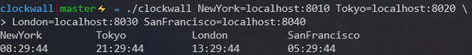

# clockwall
Connect to one or more [clock](https://github.com/ulricksennick/tgpl-exercises/ch8/clock)
instances and display a wall of clocks in the terminal.



**Note** you do not need to install Go to run this application!

Pass each clockname and host as arguments to the program.

## Usage
``` 
./clockwall <CLOCK_NAME>=<HOST> 
```

## Examples
- Run the following command to start a wall of clocks containing just one 
clock, named NewYork and connected to localhost:8010:
    ```
    ./clockwall NewYork=localhost:8010
    ```

- Multiple clocks on the wall:
    ```
    ./clockwall NewYork=localhost:8010 Tokyo=localhost:8020 London=localhost:8030 SanFrancisco=localhost:8040
    ```

## Related applications
- [clock](https://github.com/ulricksennick/tgpl-exercises/ch8/clock): spin up 
clocks over ports on your local machine for clockwall to connect to.
